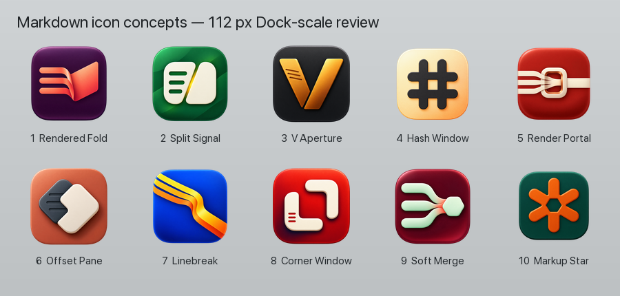

# Markdown Preview icon concepts

This is a concept round only. None of these files is wired into the app, and the
shipping `md-preview/AppIcon.icon` has not been changed.

The comparison board renders each concept at 112 px, close to the Dock-scale
example used for this review. The individual PNGs are deliberately oversized
exploration renders; a selected concept should be redrawn as controlled source
art before it becomes a production asset.

## Project context

- The public/upstream marketing icon in `docs/app-icon.png` is a monochrome
  lens-like object on white. Its silhouette and material language are too close
  to the visual territory associated with Apple's Preview app.
- The private fork's current `AppIconLayer.png` is explicitly documented as a
  placeholder: an amber rounded page with a downward chevron.
- The production icon is an Icon Composer document containing one transparent
  PNG layer. That is a convenient integration path later, but it does not make
  the concept renders production-ready.

## Market survey

Icons and product pages were inspected on 2026-09-04. Links point directly to
the icon asset where the public repository exposes one.

Open-source repositories inspected:

- [MarkEdit](https://github.com/MarkEdit-app/MarkEdit/blob/main/Icon.png) — blue quill on ruled
  paper.
- [MarkText](https://github.com/marktext/marktext/blob/develop/packages/desktop/build/icons/icon.png)
  — cyan geometric M.
- [MacDown](https://github.com/MacDownApp/macdown/blob/master/MacDown/Images.xcassets/AppIcon.appiconset/icon_512x512@2x.png)
  — cyan M plus down arrow.
- [QLMarkdown](https://github.com/sbarex/QLMarkdown/blob/main/assets/img/icon.png)
  — blue eye plus down arrow.
- [Zettlr](https://github.com/Zettlr/Zettlr/blob/develop/resources/icons/icns/icon.iconset/icon_512x512@2x.png)
  — green field and white ribbon Z.
- [Edmund](https://github.com/I7T5/Edmund/blob/main/docs/assets/AppIcon/AppIcon_512x512@2x.png)
  — black serif E on white.

Commercial/current product references inspected:

- [iA Writer](https://apps.apple.com/us/app/ia-writer/id775737590) — a sparse
  cyan vertical mark on white.
- [Marked 2](https://apps.apple.com/us/app/marked-2-markdown-preview/id890031187)
  and [Marked 3](https://apps.apple.com/us/app/marked-3/id6747497179) — cyan
  lowercase-m family marks.
- [Marked QL](https://apps.apple.com/us/app/marked-ql-markdown-preview/id6787414592)
  — white eye on cyan.
- [Read.md](https://apps.apple.com/us/app/read-md/id6760943472) — literal `.md`
  wordmark.
- [Ulysses](https://apps.apple.com/us/app/ulysses-writing-app/id1225570693) —
  yellow butterfly/fountain-pen-nib symbol.
- [Typora](https://typora.io/) and [Obsidian](https://obsidian.md/brand) were
  included as category benchmarks.

The most crowded visual territories are therefore eyes and lenses, page and
paper silhouettes, pens and quills, cyan/blue M marks, down arrows, literal
`md` wordmarks, and purple faceted/crystalline marks. This round aims away from
those combinations, though concepts 2 and 6 intentionally test card/page-like
geometry and concept 7 retains a category-adjacent blue field.

## Concepts

| # | Name | Core idea | Initial brand fit | Watch-out |
|---|---|---|---|---|
| 1 | Rendered Fold | Three source lines fold into one rendered surface | Public | Needs a flatter production redraw |
| 2 | Split Signal | Grooved source pane beside a clean output pane | Public | Slight resemblance to a book at a glance |
| 3 | V Aperture | Source and output slabs form a bold V with a narrow aperture | MDView | Strong monogram makes it less neutral |
| 4 | Hash Window | Markdown hash with a centered preview aperture | Public | Hashtag is familiar and less ownable |
| 5 | Render Portal | Three lanes pass through a viewport and become one | Lower tier | Can read as a belt or data routing |
| 6 | Offset Pane | Grooved rear surface revealed by a clean front surface | Lower tier | Reads as layered cards or fast-forward |
| 7 | Linebreak | Three lines merge through one typographic bend | Either | Bright blue field is category-adjacent |
| 8 | Corner Window | Two opposing corners frame a rendered opening | Public | Must not drift toward a crop-tool icon |
| 9 | Soft Merge | Source lines converge into a single compact result | Lower tier | Reads as a generic workflow/merge symbol |
| 10 | Markup Star | Six-spoke Markdown asterisk with a hollow aperture | Reject | Too close to Zapier's orange-asterisk language |

Early recommendation: explore **1 / Rendered Fold** for the public project and
**3 / V Aperture** for MDView. They have different silhouettes and palettes,
and each keeps a clear conceptual reason for its form. The strongest alternates
are **8 / Corner Window** for the public project and **7 / Linebreak** for
either identity. Do not advance concept 10; its first-glance resemblance to
[Zapier's orange asterisk](https://zapier.com/blog/zapier-rebrand-case-study/)
is too strong.

The full-resolution concept renders include small generation artifacts around
some outer icon edges. That does not affect this silhouette-selection round,
but the files must not be treated as production artwork.

## Next round

After two concepts are selected, redraw each as controlled vector-friendly
source art, test it at 16, 32, 64, 128, 256, 512, and 1024 px, check light and
dark appearances, place both beside common neighboring Dock icons, and then
build the production Icon Composer assets.
